<div align="center">
  <h3>انتخاب زبان / Choose Language</h3>
</div>

<details open>
<summary dir="rtl" align="right"><b>🇮🇷 فارسی (نسخه فارسی را ببندید/باز کنید)</b></summary>
<br>

<div dir="rtl" align="right">

# Silicon Valley: The Tech Cartel 🏙️

پروژه پایانی درس برنامه‌سازی پیشرفته - یک بازی استراتژیک تخته‌ای (Board Game) مشابه بازی کاتان که بر اساس مفاهیم اقتصاد دیجیتال و دنیای تکنولوژی طراحی شده است. در این بازی کارآفرینان برای جمع‌آوری منابع، ساخت شرکت‌ها و تبدیل شدن به اولین Unicorn (شرکت میلیارد دلاری) در یک پارک فناوری با یکدیگر رقابت می‌کنند.

## 🛠 تکنولوژی‌های استفاده شده

- **زبان برنامه‌نویسی:** Java (17+)
- **رابط کاربری:** JavaFX

## 🏗 معماری پروژه (Architecture)

این پروژه بر اساس الگوی طراحی MVC (Model-View-Controller) توسعه یافته تا منطق بازی کاملاً از رابط کاربری جدا باشد و کدها در پکیج‌های منطقی زیر دسته‌بندی شده‌اند:

- `logic.engine`: هسته اصلی بازی شامل `GameEngine` (مدیریت نوبت‌ها، تاس، شرایط برد)، `Map` و `AIBrain`.
- `logic.models`: هسته داده‌ها. کلاس انتزاعی (Abstract) `CompanyStructure` که زیرکلاس‌های `MVP`، `Unicorn` و `Partnership` از آن ارث‌بری می‌کنند. همچنین شامل مدل‌های داده‌ای نقشه (`Sector`, `Vertex`, `Edge`) و بازیکنان دارای نقش‌های تخصصی (`AIHackerCEOPlayer`, `AITechGuruPlayer`, `AIVCFundedPlayer` و غیره).
- `ui.controller`: کنترلرهای رابط کاربری JavaFX.
- `ui.view`: فایل‌های FXML مرتبط با رابط کاربری JavaFX.
- `exception`: استثناهای سفارشی مدیریت خطا.
- `logic.save` & `logic.sound`: سیستم مدیریت ذخیره‌سازی و پخش صدا.

## ⚙️ منطق کلی بازی

<ul dir="rtl">
  <li><b>تعداد بازیکنان:</b> ۲ تا ۴ نفر</li>
  <li><b>نقشه بازی:</b> یک شبکه ۵ در ۵ شامل ۲۵ سکتور فناوری با منابع اختصاصی. هر سکتور دارای یک عدد فعال‌سازی بین ۲ تا ۱۲ است.</li>
  <li><b>منابع موجود:</b> سرمایه (Capital)، استعداد (Talent)، زیرساخت ابری (Cloud)، پتنت (Patent)، دیتا (Data).</li>
</ul>

## 🏢 سازه‌ها (Structures) و قوانین ساخت

<ul dir="rtl">
  <li><b>قانون فاصله (Distance Rule):</b> هر شرکت ساخته شده باید حداقل ۲ یال (Edge) از شرکت دیگر فاصله داشته باشد.</li>
  <li><b>MVP (محصول اولیه):</b> ساخته شده روی گره‌ها (Vertices) | ارزش: ۱ امتیاز - تولید: ۱ منبع - منابع مورد نیاز برای ساخت: ۱ سرمایه، ۱ استعداد، ۱ زیرساخت ابری، ۱ دیتا.</li>
  <li><b>Unicorn (شرکت تک‌شاخ):</b> ارتقای MVP | ارزش: ۲ امتیاز - تولید: ۲ منبع - منابع مورد نیاز برای ساخت: ۳ دیتا، ۲ زیر ساخت ابری.</li>
  <li><b>Partnership (قرارداد همکاری):</b> ساخته شده روی یال‌ها (Edges) برای گسترش شبکه فناوری | منابع مورد نیاز: ۱ سرمایه، ۱ پتنت.</li>
</ul>

## 🎭 راهنمای نقش‌ها (Role Guide)

هر بازیکن می‌تواند نقشی با توانایی‌های منحصر‌به‌فرد انتخاب کند:

| نقش (Role) | مزیت و ویژگی ویژه |
| :--- | :--- |
| **The Hacker CEO** | در معامله با بازار، به جای نرخ استاندارد ۴:۱، با نرخ ۳:۱ معامله می‌کند |
| **The Tech Guru (CTO)** | برای ارتقای MVP به Unicorn، یک واحد زیرساخت ابری کمتر مصرف می‌کند (یعنی فقط ۱ واحد به جای ۲ واحد). |
| **The VC-Funded** | بازی را با ۲ واحد سرمایه اضافه شروع می‌کند. همچنین در بحران قانونی (تاس ۷)، حد مجاز کارت های وی قبل از مالیات ۹ کارت است (به جای ۷). |

## 🏆 سیستم امتیازدهی و شرط برد

<ul dir="rtl">
  <li><b>ساخت MVP:</b> ۱ امتیاز برای ساخت MVP دریافت می‌کنید.</li>
  <li><b>ارتقا به Unicorn:</b> و اگر به Unicorn ارتقا دهید ۱ امتیاز دیگر هم دریافت می‌کنید.</li>
  <li><b>نقش بنیان‌گذار:</b> ۱ امتیاز منفی اولیه اما دارای مزایای خاص.</li>
  <li><b>بلندترین شبکه:</b> داشتن طولانی‌ترین مسیر شبکه ۲ امتیاز اضافه به همراه دارد.</li>
  <li><b>شرط برد:</b> اولین بازیکنی که به <b>۱۰ امتیاز</b> برسد برنده بازی است.</li>
</ul>

## 🎮 نحوه بازی

<ul dir="rtl">
  <li><b>فاز اولیه (Setup Phase):</b> بازی با دو دور رفت و برگشتی آغاز می‌شود. در این فاز هر بازیکن یک MVP و یک Partnership می‌سازد. پس از پایان این دو دور، سکتورها اولین منابع را توزیع می‌کنند؛ به این صورت که هر MVP دقیقاً یک منبع از سکتورهای مجاور خود دریافت می‌کند.</li>
  <li><b>جریان اصلی بازی و پرتاب تاس:</b> در فاز اصلی، هر بازیکن <i>قبل از هر اقدامی</i> باید تاس بیندازد. اگر مجموع دو عدد تاس با عدد فعال‌سازی (۲ تا ۱۲) سکتوری که بازیکن روی گره‌های آن سازه‌ای دارد برابر باشد، سکتور مربوطه منبع تولید می‌کند (۱ منبع برای MVP و ۲ منبع برای Unicorn). 
    <ul>
      <li><i>نکته:</i> سکتورهایی با نام <b>Regulatory Zone</b> وجود دارند که در هیچ حالتی منبعی تولید نمی‌کنند.</li>
    </ul>
  </li>
  <li><b>بحران قانونی (تاس ۷) و بازرس:</b> اگر عدد تاس ۷ باشد، هیچ منبعی در آن دور توزیع نمی‌شود و بحران قانونی رخ می‌دهد. بازیکنانی که بیش از حد مجاز منبع دارند (بیشتر از ۷ منبع برای حالت عادی و بیشتر از ۹ منبع برای نقش VC-Funded) باید نیمی از منابع خود را به بانک تحویل دهند. سپس بازیکنی که تاس انداخته، باید <b>بازرس (Auditor)</b> را روی یک سکتور قرار دهد. حضور بازرس روی هر سکتور مانع از تولید منابع آن سکتور در صورت آمدن عدد آن می‌شود.</li>
  <li><b>اقدامات پس از تاس:</b> بازیکن می‌تواند پس از توزیع منابع کارهای زیر را انجام دهد:
    <ul>
      <li>ساخت MVP یا ارتقای آن به Unicorn.</li>
      <li>ساخت Partnership.</li>
      <li>خرید از فروشگاه با استفاده از سرمایه (Capital).</li>
      <li>معامله منابع با سایر بازیکنان واقعی (غیر هوش مصنوعی).</li>
      <li>پایان نوبت با کلیک روی کلید <b>END TURN</b>.</li>
    </ul>
  </li>
  <li><b>بازار پویا (Dynamic Market):</b> قیمت اولیه تمام منابع ۴ سرمایه است. قیمت‌ها ثابت نیستند؛ اگر در یک دور منبعی خریداری شود، در دور بعد قیمت آن ۱ واحد افزایش می‌یابد (حداکثر تا سقف ۶). اگر برای ۳ دور متوالی هیچکس آن منبع را نخرد، قیمت آن ۱ واحد کاهش می‌یابد (حداقل تا کف ۲). بازار مسئول مدیریت قیمت‌های پویا و تاریخچه معاملات است.</li>
  <li><b>رابط کاربری و اطلاعات بازیکنان:</b>
    <ul>
      <li>برای ذخیره بازی، کلید <b>Save Game</b> در گوشه سمت راست تعبیه شده است.</li>
      <li>در صفحه اصلی، جدولی وجود دارد که نقش، امتیاز و تعداد کل منابع هر بازیکن را نشان می‌دهد. در نوبت خودتان، با کلیک بر روی عدد «کل منابع»، می‌توانید جزئیات دقیق هر منبعی که در اختیار دارید را مشاهده کنید.</li>
    </ul>
  </li>
</ul>

## 📐 الگوهای طراحی (Design Patterns)

<ul dir="rtl">
  <li><b>الگوی MVC:</b> معماری اصلی پروژه بر پایه تفکیک کامل منطق از رابط کاربری است.</li>
  <li><b>ارث‌بری و چندریختی:</b> استفاده از کلاس انتزاعی <code>CompanyStructure</code> برای تمامی سازه‌ها.</li>
  <li><b>الگوی متد الگو (Template Method):</b> به کار رفته در کلاس <code>CompanyStructure</code> برای تعریف ساختار کلی متدهای مربوط به تولید منبع و امتیازدهی در سازه‌های مختلف.</li>
  <li><b>الگوی استراتژی (Strategy Pattern):</b> این الگو در بخش هوش مصنوعی (AI) برای انتخاب استراتژی‌های مختلف ساخت و معامله به کار رفته است.</li>
  <li><b>الگوی تک‌نسخه (Singleton/Utility Pattern):</b> برای مدیریت و دسترسی متمرکز به منابع مشترک در کلاس‌هایی مانند <code>SoundManager</code> (مدیریت صدا) و <code>SaveManager</code> (مدیریت ذخیره‌سازی).</li>
</ul>

## 📊 نمودار کلاس‌ها (UML Diagram)

نمودار کلاس‌های پروژه در ساختار کلی شیء‌گرا به شرح زیر پیاده‌سازی شده است:

```mermaid
classDiagram
direction BT
class AIBrain {
<<Interface>>
  + executeTurn(Player, GameEngine, Runnable) void
  + calculateResourcesToDiscard(Player) Map~ResourceType, Integer~
}
class AIHackerCEOPlayer {
  + AIHackerCEOPlayer(String, GameBoardController, boolean) 
  - AIBrain brain
  + playTurn(GameEngine, Runnable) void
   GameBoardController controller
   boolean AI
   AIBrain brain
}
class AIPlayer {
  + AIPlayer(String, GameBoardController, boolean) 
  - AIBrain brain
  + playTurn(GameEngine, Runnable) void
   GameBoardController controller
   boolean AI
   AIBrain brain
}
class AITechGuruPlayer {
  + AITechGuruPlayer(String, GameBoardController, boolean) 
  - AIBrain brain
  + playTurn(GameEngine, Runnable) void
   GameBoardController controller
   boolean AI
   AIBrain brain
}
class AIVCFundedPlayer {
  + AIVCFundedPlayer(String, GameBoardController, boolean) 
  - AIBrain brain
  + playTurn(GameEngine, Runnable) void
   GameBoardController controller
   boolean AI
   AIBrain brain
}
class BuildMode {
<<enumeration>>
  + BuildMode() 
  + values() BuildMode[]
  + valueOf(String) BuildMode
}
class CompanyStructure {
  + CompanyStructure(Player) 
  - Player owner
  + produce(Sector) void
   int victoryPoints
   Player owner
}
class CornerDirection {
<<enumeration>>
  + CornerDirection() 
  + values() CornerDirection[]
  + valueOf(String) CornerDirection
}
class Edge {
  + Edge(Vertex, Vertex) 
  - Vertex start
  - Vertex end
  - Partnership partnership
  + getOppositeVertex(Vertex) Vertex
   Partnership partnership
   Vertex end
   Vertex start
}
class FileItem {
  + FileItem(File) 
  - StringProperty name
  - File file
  + nameProperty() StringProperty
  - getFileCreationOrModifiedDate(File) String
  + dateProperty() StringProperty
   File file
   String name
}
class GameBoardController {
  + GameBoardController() 
  - boolean isDiceRolled
  - boolean isActiveEndTurn
  - GameEngine gameEngine
  ~ onCloudMinus() void
  ~ FileSaveFailedAlert(String) void
  ~ onBuildAPartnershipBTN() void
  ~ FileRenameSuccessfullyAlert() void
  ~ onUpgradeToUnicorn() void
  ~ ChangeShopButtonsToNotChoose(MouseEvent) void
  ~ onEditBtnSaveGameTab(ActionEvent) void
  ~ choiceAuditor(MouseEvent) void
  + initialize(GameEngine) void
  + showGameOverScreen(Player) void
  - parseCoordinates(String) int[]
  ~ onCreateBtnSaveGameTab(ActionEvent) void
  ~ showMessage(String, String, MessageMode) void
  ~ SetResourcesToChoose(MouseEvent) void
  - getEdgeFromLine(Line) Edge
  + updateEdgeUI(Edge, Color) void
  ~ onEditASave(ActionEvent) void
  - loadSaveFiles() void
  + updateUnicornUI(Vertex, Color) void
  ~ onEndTurnBTN() void
  ~ onPatentMinus() void
  ~ ChangeShopButtonsToChoose(MouseEvent) void
  - openLegalCrisisWindow() void
  ~ SetPlayerResourcesOpacityOne(MouseEvent) void
  ~ openSettingsTab() void
  - getTotalPriceAfterAdd(ResourceType) int
  ~ setPlayerResourcesUIText(Player, List~Label~) void
  + findSVGPathForVertex(Vertex) SVGPath
  ~ DeleteAFileConfirmation(String) boolean
  ~ totalResourcesCount(Player) int
  + getIsDiceRolled() boolean
  ~ ChangeTradeButtonColorToPressed(MouseEvent) void
  + showDiceResultsUI(ArrayList~Integer~, Runnable) void
  + findLineForEdge(Edge) Line
  + startNextTurn() void
  ~ onTalentMinus() void
  ~ FileCreatedSuccessfullyAlert() void
  ~ onTalentPlus() void
  ~ SetColorUnchangable(MouseEvent) void
  ~ onCloudPlus() void
  ~ onCreateANewSave(ActionEvent) void
  + resetMarketPricesUI() void
  ~ SetResourcesToNotChoose(MouseEvent) void
  ~ ChangeButtonColorToNotChoose(MouseEvent) void
  ~ onDeleteSave(ActionEvent) void
  ~ onDataPlus() void
  ~ FileNameEnterFieldMouseExit(MouseEvent) void
  ~ LoadUIElements() void
  + getIsActiveEndTurn() boolean
  ~ ChangeTradeButtonColorToNotChoose(MouseEvent) void
  + changePlayerTextColor() void
  + findCircleForVertex(Vertex) Circle
  ~ ChangeColorToNotChooseCircle(MouseEvent) void
  ~ SaveTabCreateButtonMouseEnter(MouseEvent) void
  ~ ChangeShopBuyButtonToChoose(MouseEvent) void
  ~ ChangeShopBuyButtonToNotChoose(MouseEvent) void
  ~ unchooseFileNameEnterField(MouseEvent) void
  ~ FileSavedSuccessfullyAlert() void
  ~ onShopClick() void
  + updatePlayersPoints() void
  ~ RollDice(ActionEvent) void
  ~ FileNameEnterFieldMouseEnter(MouseEvent) void
  + updateDynamicTradeButtons() void
  ~ SaveTabEditButtonMouseEnter(MouseEvent) void
  ~ ChangeButtonColorToChoose(MouseEvent) void
  - getPauseTransition(PlayableAI) PauseTransition
  + checkTurnAdvancement() void
  ~ FileDeleteFailedAlert() void
  ~ SaveTabEditButtonMouseExit(MouseEvent) void
  ~ openSaveGameTab() void
  + updateVertexUI(Vertex, Color) void
  ~ resetLabelColor() void
  ~ ChangeTradeButtonColorToChoose(MouseEvent) void
  + getPlayerColor(Player, List~Player~) Color
  - resetBuildMode() void
  ~ onTabChanged(Event) void
  ~ SaveTabButtonsMouseExit(MouseEvent) void
  + enableButtonsAfterDiceRoll() void
  ~ FileDeletedSuccessfullyAlert() void
  ~ onDataMinus() void
  ~ onSaveGame(ActionEvent) void
  + role(PlayerRole) String
  - resetMarketSelectionUI() void
  + endTurnDisable() void
  ~ SetPlayerResourcesOpacityZero(MouseEvent) void
  + refreshPlayersResourcesUI() void
  + performAIAuditorMove(int, int) void
  ~ setLabelColor(String, Label[]) void
  + updateResourceFields() void
  ~ onPatentPlus() void
  - closeCreateEditBoxes(ActionEvent, int) void
  - updateTotalPrice() void
  ~ ChangeColorToNotChooseLine(MouseEvent) void
  - openTradeWindow(ActionEvent) void
  ~ FileRenameFailedfullyAlert() void
  ~ FailedToCreateFileErrorAlert() void
  ~ SaveTabButtonsMouseEnter(MouseEvent) void
  - findEdge(Vertex, Vertex) Edge?
  ~ onBuyFromMarket(ActionEvent) void
  - getVertexFromCircle(SVGPath) Vertex
  ~ FileNotChosenAlert() void
  ~ onFileNameEnterField(MouseEvent) void
  ~ FileAlreadyExistsErrorAlert() void
  + updateTurnControls() void
  ~ onBuildAMVPBTN() void
  ~ SaveTabCreateButtonMouseExit(MouseEvent) void
  ~ ChangeColorToChoose(MouseEvent) void
  - getVertexFromCircle(Circle) Vertex
  ~ ChangeHexagonToNotChoose(MouseEvent) void
  + updateSectorImages() void
   GameEngine gameEngine
   StackPane auditorOnSector
   Color playerColor
   StackPane auditorNotOnSector
   boolean isActiveEndTurn
   boolean humanControlsDisabled
   Alert alertIcon
   boolean isDiceRolled
}
class GameEngine {
  + GameEngine(Map, List~Player~) 
  - boolean setupPlacedPartnership
  - Market market
  - int currentPlayerIndex
  - int setupRound
  - boolean setupPlacedMVP
  - boolean setupPhaseActive
  - int currentTurnNumber
  - List~Player~ players
  - Map map
  - BuildMode currentBuildMode
  - boolean mainPhaseActive
  + List~String~ LastMessage
  - int setupTurnCount
  - int setupDirection
  - int turnNumber
  + checkAndMoveToNextSetupTurn() void
  + distributeSetupResources() void
  + DFS(Vertex, Player, Set~Edge~) int
  + notifyMVPPlaced() void
  + moveAuditor(Sector) boolean
  + isResourceBelowCrisisThreshold(Player) boolean
  + updateLongestNetwork() void
  + distribute(ArrayList~Integer~) void
  + discardSelectedResources(Player, Map~ResourceType, Integer~) boolean
  + endCurrentTurn() void
  + buildMVP(Vertex, Player) void
  + trade(Map~ResourceType, Integer~, Map~ResourceType, Integer~, Player[]) void
  + setLastMessage(String, String, String) void
  + upgradeToUnicorn(Vertex, Player) void
  + rollDice() ArrayList~Integer~
  + buildPartnership(Player, Edge) void
  + winnerPlayer() Player
  + startSetupPhase() void
  + rollDiceForCurrentTurn() ArrayList~Integer~
  + processCrisisForAIOnly() void
  + canBuildPartnership(Player, Edge) boolean
  - triggerNextPlayerIfAI() void
  - calculateLongestPathForPlayer(Player) int
  + canPlaceAuditor(Sector) boolean
  + nextTurn(Runnable) void
  + calculatePlayerPoints() List~Integer~
  + notifyPartnershipPlaced() void
  + deepCopy() GameEngine
  + canBuildMVP(int, int) boolean
  + nextTurn() void
  + canUpgradeToUnicorn(int, int) boolean
   int currentTurnNumber
   BuildMode buildMode
   boolean isMessageShowed
   int currentPlayerIndex
   BuildMode currentBuildMode
   boolean setupPlacedMVP
   boolean setupPhaseActive
   boolean mainPhaseActive
   int turnNumber
   List~Player~ players
   boolean setupPhase
   boolean setupPlacedPartnership
   int setupDirection
   Player currentPlayer
   Map map
   List~String~ LastMessage
   int setupTurnCount
   Market market
   int setupRound
   boolean isDiceRolled
}
class HackerCEOPlayer {
  + HackerCEOPlayer(String, List~CompanyStructure~) 
  + calculateMarketPrice(ResourceType, int) int
   int rolePenalty
}
class IncomingTradeController {
  + IncomingTradeController() 
  ~ GameEngine gameEngine
  ~ GameBoardController gameBoardController
  ~ Player[] players
  ~ Map~ResourceType, Integer~ giveResources
  ~ Map~ResourceType, Integer~ getResources
  ~ ChangeRejectButtonColorToNotChoose(MouseEvent) void
  ~ onRejectButton(ActionEvent) void
  + setIncomingTradeLabels() void
  ~ onAcceptButton(ActionEvent) void
  - updateResourceFields(Map~ResourceType, Integer~, Label, Label, Label, Label, Label) void
  ~ ChangeAcceptButtonColorToChoose(MouseEvent) void
  ~ ChangeRejectButtonColorToChoose(MouseEvent) void
  ~ ChangeAcceptButtonColorToNotChoose(MouseEvent) void
   GameEngine gameEngine
   Map~ResourceType, Integer~ getResources
   Map~ResourceType, Integer~ giveResources
   GameBoardController gameBoardController
   Player[] players
}
class InsufficientResourcesException {
  + InsufficientResourcesException(Player, String, Map~ResourceType, Integer~) 
  - Map~ResourceType, Integer~ resources
  - Player player
   Player player
   Map~ResourceType, Integer~ resources
}
class InvalidAuditorMovementException {
  + InvalidAuditorMovementException(String, Sector, Sector) 
  - Sector sourceSector
  - Sector destinationSector
   Sector destinationSector
   Sector sourceSector
}
class InvalidMarketTransactionException {
  + InvalidMarketTransactionException(ResourceType, String) 
  - ResourceType resourceType
   ResourceType resourceType
}
class InvalidPlacementException {
  + InvalidPlacementException(Edge, String) 
  + InvalidPlacementException(Vertex, String) 
  - Vertex vertex
  - Edge edge
   Edge edge
   Vertex vertex
}
class InvalidPlayerNameException {
  + InvalidPlayerNameException(int, String) 
  - int playerNumber
  - String invalidName
   String invalidName
   int playerNumber
}
class LegalCrisisController {
  + LegalCrisisController() 
  ~ GameEngine gameEngine
  ~ onReturnToBank(MouseEvent) void
  - totalCardCount() int
  ~ onPatentMinus(MouseEvent) void
  ~ ChangeBorderWidthToChoose(MouseEvent) void
  ~ onDataMinus(MouseEvent) void
  - updateTotalCardCount() void
  ~ ChangeBorderWidthToNotChoose(MouseEvent) void
  ~ onCloudPlus(MouseEvent) void
  ~ ChangeReturnButtonToNotChoose(MouseEvent) void
  ~ onTalentPlus(MouseEvent) void
  ~ onCapitalMinus(MouseEvent) void
  ~ onTalentMinus(MouseEvent) void
  ~ onCloudMinus(MouseEvent) void
  ~ onPatentPlus(MouseEvent) void
  ~ onCapitalPlus(MouseEvent) void
  ~ totalResourcesCount(Map~ResourceType, Integer~) int
  ~ onDataPlus(MouseEvent) void
  + initData(Player, int) void
  + initialize() void
  ~ ChangeReturnButtonToChoose(MouseEvent) void
   GameEngine gameEngine
}
class MCTSAIBrain {
  + MCTSAIBrain(GameBoardController) 
  - GameBoardController controller
  - selectPromisingNode(MCTSNode) MCTSNode
  + calculateResourcesToDiscard(Player) Map~ResourceType, Integer~
  - calculateNeededResourcesForPlayer(Player) Map~ResourceType, Integer~
  - getPossibleMoves(GameEngine, Player) List~MCTSMove~
  - isGameOver(GameEngine) boolean
  - backPropagate(MCTSNode, double) void
  - upgradeUnicorn_UI(GameEngine, Vertex) void
  - evaluatePlayout(GameEngine, int) double
  - mergeRequiredCosts(Map~ResourceType, Integer~, Map~ResourceType, Integer~) void
  - processNextMove(GameEngine, Player, Runnable, int) void
  - calculateBestMoveWithMCTS(GameEngine) MCTSMove?
  - buildMVP_UI(GameEngine, Vertex) void
  - getDiceProbability(int) int
  - endTurnSafely(GameEngine, Runnable) void
  - refreshUI(GameEngine) void
  + executeTurn(Player, GameEngine, Runnable) void
  - simulateRandomPlayout(MCTSNode, int) double
  - findBestSetupMVP(GameEngine) Vertex
  - canAndShouldBuyResource(GameEngine, Player, ResourceType) boolean
  - expandNode(MCTSNode) void
  - findBestSectorCoordsForAuditor(GameEngine, Player) int[]
  - executeSetupPhaseUI(Player, GameEngine) void
  - getBestChild(MCTSNode, double) MCTSNode?
  - findBestSetupPartnership(GameEngine, Player) Edge
  - isVertexInSector(Vertex, Sector) boolean
  - tryPlaceAuditorByAI(Player, GameEngine) void
  - evaluateVertexForSetup(Vertex, Sector[][]) double
  - buildPartnership_UI(GameEngine, Edge) void
  - calculateEnemyPresence(Sector, Player) int
   GameBoardController controller
}
class MCTSMove {
<<Interface>>
  + execute(GameEngine, Player, boolean) void
   boolean rollDiceMove
   boolean endTurn
}
class MCTSNode {
  + MCTSNode(MCTSNode, MCTSMove, GameEngine) 
   boolean terminal
}
class MVP {
  + MVP(Player) 
  + produce(Sector) void
   int victoryPoints
}
class Main {
  + Main() 
  + main(String[]) void
  + start(Stage) void
}
class MainMenuController {
  + MainMenuController() 
  - double gameSoundVolume
  + createPlayer(TextField, Label, boolean) boolean
  ~ onExitButton(ActionEvent) void
  ~ ResetRole(MouseEvent) void
  ~ onBacktoMainMenuButton(ActionEvent) void
  ~ LoadMenuButtonsMouseEnter(MouseEvent) void
  ~ onNextPlayer(MouseEvent) void
  ~ ButtonsMouseEnter(MouseEvent) void
  ~ ButtonsMouseExit(MouseEvent) void
  ~ onStartGame(ActionEvent) void
  ~ onLoadGame(ActionEvent) void
  ~ LobbyButtonsMouseExit(MouseEvent) void
  ~ ResetAllPages() void
  ~ LoadMenuButtonsMouseExit(MouseEvent) void
  ~ HardAICheckboxesMouseEnter(MouseEvent) void
  ~ StartButtonMouseEnter(MouseEvent) void
  ~ OnStartANewGame(ActionEvent) void
  - loadSaveFiles() void
  + initialize() void
  ~ OnLoadAGame(ActionEvent) void
  ~ onSettings(ActionEvent) void
  - isNameValid(String) boolean
  ~ BackButtonMouseEnter(MouseEvent) void
  ~ ChangeRoleToChoose(MouseEvent) void
  ~ NextPlayerButtonMouseEnter(MouseEvent) void
  ~ RoleMouseEnter(MouseEvent) void
  + disableGroup() void
  + getPlayerSelection(int) String
  - equals(String) boolean
  - setToggleImage(ToggleButton, Image) void
  ~ onAboutUs(ActionEvent) void
  - isHumanToggle(String) boolean
  + selectRole(ImageView, Label) void
  + role(Label) PlayerRole
  ~ ResetAllButtonMouseEnter(MouseEvent) void
  ~ onResetAll(MouseEvent) void
   double gameSoundVolume
   Alert alertIcon
}
class Map {
  + Map(int, int) 
  - int rows
  - int cols
  - Sector[][] sectors
  - Vertex[][] vertices
  - List~Edge~ edges
  - initMap() void
   Vertex[][] vertices
   int rows
   Sector[][] sectors
   List~Edge~ edges
   int cols
}
class Market {
  + Market() 
  + getPrice(ResourceType) int
  + updateMarketAtEndOfRound() void
  + buyFromMarket(GameEngine, Player, ResourceType, int) void
}
class MessageMode {
<<enumeration>>
  + MessageMode() 
  + values() MessageMode[]
  + valueOf(String) MessageMode
}
class MusicFileNotFoundException {
  + MusicFileNotFoundException() 
  + MusicFileNotFoundException(String) 
}
class Partnership {
  + Partnership(Player) 
  - Player owner
   Player owner
}
class PlayableAI {
<<Interface>>
  + playTurn(GameEngine, Runnable) void
   AIBrain brain
}
class Player {
  + Player(String, List~CompanyStructure~) 
  # List~CompanyStructure~ companies
  - boolean canPlaceAuditor
  - String playerName
  # boolean hasLongestNetwork
  + calculateMarketPrice(ResourceType, int) int
  + addCompanyStructure(CompanyStructure) void
  + hasMVP() boolean
  + deductResourcesForPartnership() void
  + getResources(ResourceType) int
  + removeCompanyStructure(CompanyStructure) void
  + deductResourcesForMVP() void
  + deductResource(ResourceType, int) void
  + deductResourcesForUnicornUpgrade() void
  + hasResourcesForMVP() boolean
  + hasResourcesForUnicornUpgrade() boolean
  + addResource(ResourceType, int) void
  + hasResourcesForPartnership() boolean
  + toString() String
  + calculateVictoryPoints() int
   int crisisModifierThreshold
   String playerName
   int rolePenalty
   int upgradeCloudDiscount
   Map~ResourceType, Integer~ resourceCount
   List~CompanyStructure~ companies
   PlayerRole role
   boolean AI
   boolean hasLongestNetwork
   boolean canPlaceAuditor
}
class PlayerRole {
<<enumeration>>
  + PlayerRole() 
  + valueOf(String) PlayerRole
  + values() PlayerRole[]
}
class PlayerRoleNotSelectedException {
  + PlayerRoleNotSelectedException(int) 
  - int playerNumber
   int playerNumber
}
class PlayerTypeNotSelectedException {
  + PlayerTypeNotSelectedException(int) 
  - int playerNumber
   int playerNumber
}
class ResourceType {
<<enumeration>>
  + ResourceType() 
  + valueOf(String) ResourceType
  + values() ResourceType[]
}
class SFXManager {
  + SFXManager() 
  + play(String) void
  + preload(String[]) void
   double volume
}
class SFXNotFoundException {
  + SFXNotFoundException(String) 
  + SFXNotFoundException() 
}
class SaveManager {
  + SaveManager() 
  + load(File) GameEngine
  + save(GameEngine, File) void
}
class Sector {
  + Sector(ResourceType, int, boolean) 
  - Map~CornerDirection, Vertex~ corners
  - ResourceType resourceType
  + hasAnyCompanyOnSector() boolean
  + getactivationNumber() int
  + getCorner(CornerDirection) Vertex
  + setCorner(CornerDirection, Vertex) void
   boolean auditor
   Map~CornerDirection, Vertex~ corners
   ResourceType resourceType
}
class SimpleAIBrain {
  + SimpleAIBrain(GameBoardController) 
  - GameBoardController controller
  + executeTurn(Player, GameEngine, Runnable) void
  - findBestSectorCoordsForAuditor(GameEngine, Player) int[]
  - calculateEnemyPresence(Sector, Player) int
  - placeSetupPartnership(Player, GameEngine) void
  - tryPlaceAuditorByAI(Player, GameEngine) void
  - tryUpgradeToUnicorn(Player, GameEngine) void
  - scheduleAction(Runnable) void
  + calculateResourcesToDiscard(Player) Map~ResourceType, Integer~
  - executeSetupPhase(Player, GameEngine) void
  - placeSetupMVP(Player, GameEngine) void
  - tryBuildMVP(Player, GameEngine) void
  - tryMarketTrade(Player, GameEngine) void
  - tryBuildPartnership(Player, GameEngine) void
  - refreshUI(GameEngine) void
  - tryBuyResource(GameEngine, Player, ResourceType, int) boolean
   GameBoardController controller
}
class SoundManager {
  + SoundManager() 
  + resumeMusic() void
  + playBackgroundMusic(String) void
  + pauseMusic() void
  + stopMusic() void
   double volume
}
class TechGuruPlayer {
  + TechGuruPlayer(String, List~CompanyStructure~) 
   int rolePenalty
   int upgradeCloudDiscount
}
class TradeRequestController {
  + TradeRequestController() 
  ~ GameBoardController gameBoardController
  ~ onGiveTalentPlus(MouseEvent) void
  ~ onGetCloudPlus(MouseEvent) void
  + initialize() void
  ~ onGetPatentMinus(MouseEvent) void
  ~ ChangeResetButtonColorToChoose(MouseEvent) void
  ~ onGetTalentPlus(MouseEvent) void
  ~ onGetCloudMinus(MouseEvent) void
  ~ ChangeRequestButtonColorToChoose(MouseEvent) void
  ~ onGivePatentPlus(MouseEvent) void
  ~ ChangeRequestButtonColorToNotChoose(MouseEvent) void
  ~ onGetCapitalPlus(MouseEvent) void
  ~ onGiveTalentMinus(MouseEvent) void
  ~ onGiveCloudPlus(MouseEvent) void
  - resetAll() void
  ~ ChangeResetButtonColorToNotChoose(MouseEvent) void
  ~ onGiveCapitalMinus(MouseEvent) void
  ~ onGetPatentPlus(MouseEvent) void
  ~ onGiveDataMinus(MouseEvent) void
  ~ onGetDataMinus(MouseEvent) void
  ~ onResetAll(ActionEvent) void
  ~ onGetDataPlus(MouseEvent) void
  ~ onGiveCapitalPlus(MouseEvent) void
  + setData(GameEngine, Player[]) void
  ~ onGiveCloudMinus(MouseEvent) void
  ~ onGivePatentMinus(MouseEvent) void
  ~ ChangeBorderWidthToNotChoose(MouseEvent) void
  - onRequestButton(ActionEvent) void
  ~ onGetTalentMinus(MouseEvent) void
  + setLabel() void
  ~ onGiveDataPlus(MouseEvent) void
  ~ onGetCapitalMinus(MouseEvent) void
  ~ putResources(int, int, int, int, int) Map~ResourceType, Integer~
  ~ ChangeBorderWidthToChoose(MouseEvent) void
   GameBoardController gameBoardController
}
class Unicorn {
  + Unicorn(Player) 
  + produce(Sector) void
   int victoryPoints
}
class VCFundedPlayer {
  + VCFundedPlayer(String, List~CompanyStructure~) 
   int crisisModifierThreshold
   int rolePenalty
}
class Vertex {
  + Vertex() 
  - CompanyStructure companyStructure
  - List~Edge~ adjacentEdges
  + addAdjacentEdge(Edge) void
   CompanyStructure companyStructure
   List~Edge~ adjacentEdges
}

AIHackerCEOPlayer  -->  HackerCEOPlayer 
AIHackerCEOPlayer  ..>  PlayableAI 
AIPlayer  ..>  PlayableAI 
AIPlayer  -->  Player 
AITechGuruPlayer  ..>  PlayableAI 
AITechGuruPlayer  -->  TechGuruPlayer 
AIVCFundedPlayer  ..>  PlayableAI 
AIVCFundedPlayer  -->  VCFundedPlayer 
HackerCEOPlayer  -->  Player 
MCTSAIBrain  ..>  AIBrain 
MCTSAIBrain  -->  MCTSMove 
MCTSAIBrain  -->  MCTSNode 
MVP  -->  CompanyStructure 
SimpleAIBrain  ..>  AIBrain 
TechGuruPlayer  -->  Player 
Unicorn  -->  CompanyStructure 
VCFundedPlayer  -->  Player 
```

## 👥 گزارش تفصیلی تقسیم کار اعضای گروه

| توسعه‌دهنده | بخش‌های تحت مسئولیت اختصاصی | بخش‌های توسعه‌یافته به صورت مشترک (Shared) |
| :--- | :--- | :--- |
| **امیرمهدی سهیلی** | <ul><li>طراحی و پیاده‌سازی کامل رابط کاربری (UI/UX) بازی در JavaFX</li><li>طراحی، قالب‌بندی و استایل‌دهی فایل‌های نمایشی FXML با SceneBuilder</li><li>صداگذاری، افکت‌های صوتی و توسعه لایه مدیریت صوت (Sound/SFX Managers)</li></ul> | <ul style="margin-bottom: 0;"><li><b>کلاس‌های اولیه پروژه (Initial Classes):</b> طراحی و معماری اولیه کلاس‌های پایه مانند <code>Player</code>، <code>Sector</code>، <code>Vertex</code>، <code>Edge</code> و کلاس‌های استثنای سفارشی.</li><li><b>کنترلرهای پروژه (Controllers):</b> همکاری نزدیک در پیاده‌سازی و اتصال کدهای منطقی به کنترلرهای لایه نمایش (مانند <code>GameBoardController</code> و <code>MainMenuController</code>) جهت یکپارچه‌سازی رابط کاربری و موتور بازی.</li></ul> |
| **رضا معصومی** | <ul><li>طراحی و توسعه موتور اصلی بازی (Core Game Engine) و شبیه‌سازی منطق نوبت‌ها</li><li>طراحی و توسعه سیستم هوش مصنوعی بازی (AIBrain) و هدایت خودکار ربات‌ها</li><li>پیاده‌سازی مکانیزم‌های ریاضیاتی مانند الگوی جستجوی عمق اول (DFS) برای کشف بلندترین مسیر شبکه</li></ul> | <ul style="margin-bottom: 0;"><li><b>کلاس‌های اولیه پروژه (Initial Classes):</b> طراحی و معماری اولیه کلاس‌های پایه مانند <code>Player</code>، <code>Sector</code>، <code>Vertex</code>، <code>Edge</code> و کلاس‌های استثنای سفارشی.</li><li><b>کنترلرهای پروژه (Controllers):</b> همکاری نزدیک در پیاده‌سازی و اتصال کدهای منطقی به کنترلرهای لایه نمایش (مانند <code>GameBoardController</code> و <code>MainMenuController</code>) جهت یکپارچه‌سازی رابط کاربری و موتور بازی.</li></ul> |

## 💻 جزئیات فنی

<ul dir="rtl">
  <li><b>مدیریت Threadها:</b> جداسازی کامل منطق بازی (Logic) و عملیات سنگین (مثل ذخیره‌سازی) از Thread اصلی رابط کاربری (UI) جهت جلوگیری از فریز شدن صفحه. آپدیت‌های UI از طریق <code>Platform.runLater()</code> انجام می‌شود.</li>
  <li><b>سیستم ذخیره‌سازی (Save/Load):</b> پیاده‌سازی قابلیت ذخیره و بارگذاری کامل وضعیت بازی (شامل نقشه، بازار و وضعیت بازیکنان) با استفاده از قابلیت Serialization در جاوا.</li>
  <li><b>مدیریت استثناها و پایداری:</b> استفاده از کلاس‌های استثنای سفارشی (مانند <code>InsufficientResourcesException</code> و <code>InvalidPlacementException</code>) برای کنترل دقیق جریان و جلوگیری از کرش کردن بازی.</li>
  <li><b>گزارش تست (No Crash Policy):</b> بازی به گونه‌ای طراحی و تست شده است که تحت هیچ شرایطی (حتی با ورودی‌های نامعتبر بازیکن) کرش نمی‌کند و خطاهای منطقی به درستی هندل می‌شوند.</li>
</ul>

## 🤖 هوش مصنوعی (AI)

بازی دارای ربات‌های هوشمند با کلاس‌های نقش‌محور است که از <code>AIBrain</code> برای تصمیم‌گیری استفاده می‌کنند. هوش مصنوعی قادر به انجام وظایف زیر است:
<ul dir="rtl">
  <li>ساخت MVP و Partnership و ارتقا به Unicorn</li>
  <li>خرید منابع از فروشگاه</li>
  <li>تحویل دادن هوشمندانه منابع هنگام رخ دادن بحران قانونی</li>
  <li>استقرار هدفمند بازرس (Auditor)</li>
</ul>

## 🚀 نحوه اجرا

<ol dir="rtl">
  <li><b>نیازمندی‌ها:</b> نصب بودن Java 17 (یا بالاتر) و JavaFX.</li>
  <li>پروژه را در IDE مورد نظر خود (IntelliJ IDEA یا VS Code) باز کنید.</li>
  <li>کلاس اصلی برنامه (Main) را اجرا کنید.</li>
  <li>در صفحه ورود، نام بازیکنان و نقش‌های آن‌ها را انتخاب کرده و وارد بازی شوید.</li>
</ol>

</div>
</details>

---

<details>
<summary><b>🇬🇧 English (Click to expand English version)</b></summary>
<br>

# Silicon Valley: The Tech Cartel 🏙️

Advanced Programming Final Project - A strategic board game inspired by Catan, based on the concepts of the digital economy and the tech world. Players compete as entrepreneurs in a technology park to gather resources, build startups, and become the first to build a Unicorn.

## 🛠 Technologies Used

- **Programming Language:** Java (17+)
- **User Interface:** JavaFX

## 🏗 Project Architecture

This project is developed based on the **MVC (Model-View-Controller)** design pattern to completely decouple game logic from the user interface. The codebase is categorized into the following logical packages:

- `logic.engine`: Core game engine handling turn management, dice, win conditions, and the `AIBrain`.
- `logic.models`: Core data models. Includes the abstract `CompanyStructure` class (parent to `MVP`, `Unicorn`, and `Partnership`), map elements (`Sector`, `Vertex`, `Edge`), and specialized player role classes (e.g., `HackerCEOPlayer`, `VCFundedPlayer`).
- `ui.controller`: JavaFX UI controllers.
- `ui.view`: FXML layout files.
- `exception`: Custom exceptions for specific error handling.
- `logic.save` & `logic.sound`: Game state save/load manager and sound player systems.

## ⚙️ Overall Game Logic

- **Players:** 2 to 4
- **Game Map:** A 5x5 grid containing 25 technology sectors. Each sector has an activation number between 2 and 12.
- **Available Resources:** Capital, Talent, Cloud, Patent, Data.

### 🏢 Structures & Building Rules

- **Distance Rule:** Every constructed company must be at least 2 edges away from any other company.
- **MVP (Minimum Viable Product):** Built on Vertices. Value: 1 point. Production: 1 resource. Requires: 1 Capital, 1 Talent, 1 Cloud, 1 Data.
- **Unicorn:** Upgrade of MVP. Value: 2 points. Production: 2 resources. Requires: 3 Data, 2 Cloud.
- **Partnership:** Built on Edges to expand the tech network. Requires: 1 Capital, 1 Patent.

### 🎭 Role Guide

Players can select roles with unique abilities:

| Role | Special Perk |
| :--- | :--- |
| **Hacker CEO** | Trade discount (3:1 conversion rate instead of 4:1). |
| **Tech Guru** | Upgrading structures requires fewer resources. |
| **VC-Funded** | Higher starting capital and legal crisis resistance (holds up to 9 cards instead of 7). |

### 🏆 Scoring System and Win Condition

- **Building an MVP:** Grants 1 point.
- **Upgrading to Unicorn:** Grants 1 additional point.
- **Founder Role:** Initial -1 point penalty.
- **Longest Network:** Having the longest continuous network path grants an additional 2 points.
- **Win Condition:** The first player to reach **10 points** wins the game.

## 🎮 How to Play

- **Setup Phase:** The game starts with a two-round snake draft. During this phase, each player places one MVP and one Partnership per round. At the end of the setup phase, starting resources are distributed: each MVP generates exactly one resource from its adjacent sectors.
- **Main Phase & Dice Roll:** At the start of every turn, a player *must* roll the dice before taking any other action. If the sum of the dice matches the activation number (2-12) of a sector where players have built structures, that sector produces resources (1 resource for an MVP, 2 resources for a Unicorn).
  - *Regulatory Zones:* These specific sectors never produce resources under any circumstances.
- **Legal Crisis (Rolling a 7) & The Auditor:** Rolling a 7 halts all resource production for that turn and triggers a Legal Crisis. Players holding too many resources (more than 7 normally, or more than 9 for the VC-Funded role) must discard half of their hand to the bank. The player who rolled the 7 must then move the **Auditor** to a new sector. The sector occupied by the Auditor is blocked and will not produce resources even if its number is rolled.
- **Player Actions:** After rolling the dice, a player can:
  - Build an MVP or upgrade an existing MVP to a Unicorn.
  - Build a Partnership to expand their network.
  - Buy resources from the Market using Capital.
  - Trade resources with other human players (non-AI).
  - Click the **END TURN** button to pass the turn.
- **Dynamic Market:** All resources start at a base price of 4 Capital. The prices are not fixed. If a resource is purchased during a round, its price increases by 1 the next round (up to a maximum of 6). If a resource is not bought for 3 consecutive rounds, its price decreases by 1 (down to a minimum of 2). The `Market` model handles history and price tracking.
- **UI Features:**
  - A **Save Game** button is available in the top right corner.
  - The main scoreboard displays each player's role, victory points, and total resource count. During your turn, clicking on your total resource count will expand a detailed breakdown of the specific resources you own.

## 📐 Design Patterns

- **MVC Pattern:** Complete separation of logic from the user interface.
- **Inheritance & Polymorphism:** Using the abstract `CompanyStructure` class for all physical structures.
- **Template Method Pattern:** Applied in the `CompanyStructure` to define the structural logic of resource production and scoring in its subclasses.
- **Strategy Pattern:** Applied in the AI's logic to choose different building and trading strategies dynamically.
- **Singleton / Utility Pattern:** Implemented for centralized access to shared resources, prominently in `SoundManager` and `SaveManager`.

## 📊 UML Class Diagram

Below is the complete project UML structure rendered dynamically via Mermaid:

```mermaid
classDiagram
    direction BT
    
    %% Abstract & Interface definitions
    class PlayableAI {
        <<Interface>>
    }
    class AIBrain {
        <<Interface>>
    }
    class CompanyStructure {
        <<abstract>>
    }
    
    %% Enumerations
    class BuildMode {
        <<enumeration>>
        MVP
        UNICORN
        PARTNERSHIP
    }
    class PlayerRole {
        <<enumeration>>
        HACKER_CEO
        TECH_GURU
        VC_FUNDED
    }
    class ResourceType {
        <<enumeration>>
        CAPITAL
        TALENT
        CLOUD
        PATENT
        DATA
    }
    class CornerDirection {
        <<enumeration>>
    }
    class MessageMode {
        <<enumeration>>
    }
    
    %% Player Inheritance structure
    class Player {
        +String name
        +PlayerRole role
        +int victoryPoints
        +Map resources
        +canBuild()
    }
    class HackerCEOPlayer {
        +getMarketRate()
    }
    class TechGuruPlayer {
        +getUpgradeCost()
    }
    class VCFundedPlayer {
        +getMaxHandSize()
    }
    
    Player <|-- HackerCEOPlayer
    Player <|-- TechGuruPlayer
    Player <|-- VCFundedPlayer
    
    %% AI Implementations
    class AIPlayer
    class AIHackerCEOPlayer
    class AITechGuruPlayer
    class AIVCFundedPlayer
    
    Player <|-- AIPlayer
    AIPlayer ..|> PlayableAI
    
    HackerCEOPlayer <|-- AIHackerCEOPlayer
    AIHackerCEOPlayer ..|> PlayableAI
    
    TechGuruPlayer <|-- AITechGuruPlayer
    AITechGuruPlayer ..|> PlayableAI
    
    VCFundedPlayer <|-- AIVCFundedPlayer
    AIVCFundedPlayer ..|> PlayableAI
    
    %% AI Brain logic
    class SimpleAIBrain
    class MCTSAIBrain
    
    SimpleAIBrain ..|> AIBrain
    MCTSAIBrain ..|> AIBrain
    
    %% Structures
    class MVP
    class Unicorn
    class Partnership
    
    CompanyStructure <|-- MVP
    CompanyStructure <|-- Unicorn
    
    %% Map Elements
    class Map
    class Sector
    class Vertex
    class Edge
    
    Map --> "*" Sector
    Map --> "*" Vertex
    Map --> "*" Edge
    
    %% Core Engines
    class GameEngine
    class Market
    class SaveManager
    class SoundManager
    class SFXManager
    
    GameEngine --> "1" Map
    GameEngine --> "1" Market
    GameEngine --> "*" Player : manages
    
    %% Custom Exceptions
    class InsufficientResourcesException
    class InvalidPlacementException
    class InvalidAuditorMovementException
    class InvalidMarketTransactionException
    class InvalidPlayerNameException
    class PlayerRoleNotSelectedException
    class PlayerTypeNotSelectedException
    class MusicFileNotFoundException
    class SFXNotFoundException
    
    %% Controllers and UI
    class Main
    class GameBoardController
    class MainMenuController
    class IncomingTradeController
    class TradeRequestController
    class LegalCrisisController
```



## 👥 Team Work & Task Division

| Developer             | Core Responsibilities | Shared Responsibilities |
|:----------------------| :--- | :--- |
| **Amirmahdi Soheyli** | <ul><li>Designed & implemented the complete game UI/UX in JavaFX</li><li>Created and styled FXML UI layouts with SceneBuilder</li><li>Handled audio integration, sound effects, and developed sound managers (`SoundManager`/`SFXManager`)</li></ul> | <ul><li><b>Initial Classes:</b> Collaborated on the design and foundation of core classes like <code>Player</code>, <code>Sector</code>, <code>Vertex</code>, <code>Edge</code>, and custom Exception classes.</li><li><b>Controllers:</b> Integrated core logic handlers with UI layers (e.g., <code>GameBoardController</code> and <code>MainMenuController</code>) for seamless frontend-backend integration.</li></ul> |
| **Reza Masoumi**      | <ul><li>Designed & developed the core Game Engine and turn sequence logic</li><li>Created and tuned the Artificial Intelligence engine (`AIBrain`) and automated bots</li><li>Implemented network calculation algorithms (such as DFS to find the longest network path)</li></ul> | <ul><li><b>Initial Classes:</b> Collaborated on the design and foundation of core classes like <code>Player</code>, <code>Sector</code>, <code>Vertex</code>, <code>Edge</code>, and custom Exception classes.</li><li><b>Controllers:</b> Integrated core logic handlers with UI layers (e.g., <code>GameBoardController</code> and <code>MainMenuController</code>) for seamless frontend-backend integration.</li></ul> |

## 💻 Technical Details

- **Thread Management:** Full separation of game logic and heavy operations (like saving) from the main UI thread to prevent UI freezing. UI updates are handled safely via `Platform.runLater()`.
- **Save/Load System:** Implemented full save/load functionality of the game state (including map, market, and players) using Java Serialization.
- **Exception Management & Stability:** Utilization of custom exception classes (such as `InsufficientResourcesException` and `InvalidPlacementException`) for precise game flow control and crash prevention.
- **No Crash Policy (Testing):** The game is heavily tested and designed strictly to not crash under any circumstances, properly handling all forms of invalid inputs from players.

## 🤖 Artificial Intelligence (AI)

The game features smart bots via role-specific classes, which rely on `AIBrain` for decision-making. The AI is capable of:

- Building MVPs, Partnerships, and upgrading to Unicorns.
- Purchasing from the market based on internal logic.
- Smart resource discarding during a legal crisis.
- Targeted deployment of the Auditor to disrupt opponents.

## 🚀 How to Run

1. **Requirements:** Java 17 (or higher) and JavaFX must be installed.
2. Open the project in your preferred IDE (IntelliJ IDEA or VS Code).
3. Run the `Main` application class.
4. On the login screen, enter player names, select their roles, and start the game.

</details>
